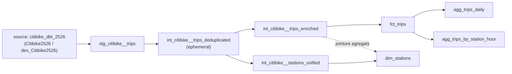

# Citibike2526

Ce projet de portfolio dbt en Analytics Engineering a pour but de transformer les données publiques Citibike NYC de juillet 2025 à juin 2026.

Liste non exhaustive des pratiques dbt utilisées dans ce projet :
- Une architecture en couches (staging → intermediate → marts) 
- Import de source depuis BigQuery
- Tests génériques dbt-utils et tests custom unitaires
- Déduplication via un modèle éphémère
- Enrichissement métier
- Modèles d'agrégation pour faciliter l'analyse BI

---

## Table des matières
- [Citibike2526](#citibike2526)
  - [Table des matières](#table-des-matières)
  - [1. Stack](#1-stack)
  - [2. Architecture des modèles](#2-architecture-des-modèles)
    - [Graphe de dépendances (lineage)](#graphe-de-dépendances-lineage)
  - [3. Détail des modèles](#3-détail-des-modèles)
    - [Staging](#staging)
    - [Intermediate](#intermediate)
    - [Marts (`mobility`)](#marts-mobility)
  - [4. Tests de qualité de données](#4-tests-de-qualité-de-données)
    - [Tests génériques](#tests-génériques)
    - [Tests singuliers (custom)](#tests-singuliers-custom)
  - [5. Profiles et environnements dev / prod](#5-profiles-et-environnements-dev--prod)
    - [Profiles](#profiles)
      - [Structure](#structure)
    - [Environnements](#environnements)
  - [6. Prérequis](#6-prérequis)
    - [En local (dev)](#en-local-dev)
    - [Côté CI/CD (GitHub Actions)](#côté-cicd-github-actions)
  - [7. Utilisation en local](#7-utilisation-en-local)
  - [8. Arborescence du projet](#8-arborescence-du-projet)

---

## 1. Stack
| Composant | Détail |
|---|---|
| Transformation | dbt Core |
| Entrepôt | Google BigQuery |
| Package dbt | [`dbt_utils`](https://github.com/dbt-labs/dbt-utils) `>=1.1.0,<2.0.0` (verrouillé en `1.4.1`) |
| Données sources | Exports de tous les trajets Citibike NYC, juillet 2025 à juin 2026, téléchargés mensuellement, concaténés et chargés sur un bucket Google Cloud Storage (GCS) vers BigQuery (+ rajout du schéma de données sur BigQuery) |
| Nom du projet dbt | `citibike_dbt_2526` |

---

## 2. Architecture des modèles

```
staging/citibike/
└── stg_citibike__trips              (view)   — nettoyage / retypage, 1 ligne par trajet

intermediate/
├── int_citibike__trips_deduplicated (ephemeral) — dédoublonnage sur ride_id
├── int_citibike__trips_enriched     (table)     — durée, distance, calendrier, filtrage des aberrations
└── int_citibike__stations_unified   (table)     — dimension station dédupliquée

marts/mobility/
├── dim_stations                     (table)   — dimension station + compteurs de trafic
├── fct_trips                        (table)   — table de faits, 1 ligne par trajet
├── agg_trips_daily                  (table)   — agrégat journalier (type vélo / usager / jour)
└── agg_trips_by_station_hour        (table)   — agrégat par station de départ et heure
```

### Graphe de dépendances (lineage)



Note :
`int_citibike__trips_deduplicated` est **éphémère** : il n'est jamais matérialisé en base. dbt l'inline en CTE dans chaque modèle qui le référence (`int_citibike__trips_enriched` et `int_citibike__stations_unified`).

---

## 3. Détail des modèles

### Staging

| Modèle | Matérialisation | Rôle |
|---|---|---|
| `stg_citibike__trips` | `view` | Sélectionne la source `dev`/`prod`, renomme `member_casual` → `member_type`, cast les timestamps (`started_at`, `ended_at`) et les coordonnées (`start_lat/lng`, `end_lat/lng`) en types stricts. |

### Intermediate

| Modèle | Matérialisation | Rôle |
|---|---|---|
| `int_citibike__trips_deduplicated` | `ephemeral` | Déduplique par `ride_id` (garde la ligne la plus ancienne via `row_number()` sur `started_at`). |
| `int_citibike__trips_enriched` | `table`, clustered sur `start_station_id, member_type` | Calcule `trip_duration_minutes`, `is_round_trip`, `start_day_of_week`, `start_hour`, `day_type` (weekday/weekend) et `distance_km` (haversine_distance via `dbt_utils`). Filtre les trajets à durées aberrantes (durée  ≤ 0 ou ≥ 1440 min).
| `int_citibike__stations_unified` | `table` | Regroupe les stations de départ et d'arrivée, garde par `station_id` l'observation lat/lng la plus récente (les coordonnées pouvant légèrement dériver dans le temps pour une même station). |

### Marts (`mobility`)

| Modèle | Matérialisation | Rôle |
|---|---|---|
| `dim_stations` | `table` | Dimension station enrichie des compteurs `nb_departures`, `nb_arrivals`, `nb_total_trips`. |
| `fct_trips` | `table`, clustered sur `start_station_id, member_type` | Table de faits au grain trajet, colonnes prêtes pour l'analyse BI. |
| `agg_trips_daily` | `table` | Agrégat journalier par `rideable_type` / `member_type` / `day_type` (volumes, durée et distance moyennes, nombre de trajets aller-retour). |
| `agg_trips_by_station_hour` | `table` | Agrégat par station de départ et heure, pour l'analyse des patterns horaires. |

---

## 4. Tests de qualité de données

Ce projet comprend deux types de tests :
- Des tests génériques (built-in dbt + `dbt_utils`) qui figurent dans les fichiers `*__models.yml` de chaque sous dossier (staging, intermediate, marts).
- Des tests singuliers custom dans `tests/`

### Tests génériques

| Modèle | Colonne | Test | Objectif |
|---|---|---|---|
| `source: Citibike2526 / dev_Citibike2526` | `ride_id` | `unique`, `not_null` | Identifiant unique par trajet source |
| | `started_at` | `not_null` | Heure de départ obligatoire |
| | `ended_at` | `not_null` | Heure d'arrivée obligatoire |
| | `member_casual` | `accepted_values` (`member`, `casual`) | Catégorie d'usager valide |
| | `rideable_type` | `accepted_values` (`classic_bike`, `electric_bike`, `docked_bike`) | Type de vélo valide |
| `stg_citibike__trips` | `ride_id` | `unique`, `not_null` | Contrôle du maintien de l'identifiant unique sur la source |
| | `rideable_type` | `accepted_values` | Type de vélo valides sur la source |
| | `member_type` | `accepted_values` | Idem après renommage de `member_casual` |
| | `started_at` / `ended_at` | `not_null` | Idem après cast en `timestamp` |
| | `start_lat` / `end_lat` | `dbt_utils.accepted_range` (40.4 à 41.0) | Coordonnées correspondant à la zone NYC, détection des erreurs GPS aberrantes |
| `int_citibike__trips_enriched` | `ride_id` | `unique`, `not_null` | Vérifie qu'il n'y a pas de doublon introduit par les jointures/enrichissements |
| | `trip_duration_minutes` | `dbt_utils.accepted_range` (0 à 1440) | Cohérence avec le filtre appliqué dans le modèle (durée strictement positive et < 24h) |
| | `start_station_id` | `relationships` → `int_citibike__stations_unified.station_id` | Intégrité référentielle vers la dimension station |
| `int_citibike__stations_unified` | `station_id` | `unique`, `not_null` | Une ligne par station après déduplication |
| `dim_stations` | `station_id` | `unique`, `not_null` | Clé unique de dimension valide |
| `fct_trips` | `ride_id` | `unique`, `not_null` | Grain de la table de faits respecté |
| | `start_station_id` | `relationships` → `dim_stations.station_id` | Intégrité référentielle départ |
| | `end_station_id` | `relationships` → `dim_stations.station_id` | Intégrité référentielle arrivée |
| `agg_trips_daily` | `trips_by_day_id` | `unique`, `not_null` | Clé surrogate (générée par`dbt_utils.generate_surrogate_key`) valide |
| | *(table)* | `dbt_utils.expression_is_true` (`nb_trips >= 0`) | Contrôle sur l'agrégat |
| `agg_trips_by_station_hour` | `trips_by_station_hour_id` | `unique`, `not_null` | Clé surrogate valide |

### Tests singuliers (custom)
Ces deux tests jouent le rôle de **test de cohérence inter-couches** (mart d'agrégation vs table de faits), en complément des tests génériques qui, eux, valident chaque colonne indépendamment.

| Fichier | Rôle |
|---|---|
| `tests/assert_nb_departures.sql` | Vérifie que le nombre total de départs dans `fct_trips` (`count(start_station_id)`) est égal à la somme de `nb_departures` dans `dim_stations`. Le test échoue (retourne des lignes) si un écart est détecté. |
| `tests/assert_nb_arrivals.sql` | Même logique côté arrivées : `count(end_station_id)` dans `fct_trips` vs `sum(nb_arrivals)` dans `dim_stations`. |

---

## 5. Profiles et environnements dev / prod

### Profiles

Pour le projet en local, le fichier `profiles.yml` se trouve dans `./dbt`.
Sur le repo, `profile.yml` se crée grâce aux actions GitHub dans `.github/workflows/main.yml`.

#### Structure
Il contient deux targets `dev` et `prod` identiques. La différenciation se fait dans le script (voir la prochaine section "Environnements").
Il été paramétré pour rajouter le projet avec un compte de service BigQuery (avec le rôle propriétaire) avec une clé générée json et rajoutée sur le fichier. 

```yaml
citibike_dbt_2526:
  target : dev
  outputs:
    dev:
      type: bigquery
      project: *********
      dataset: citibike_dataset
      job_execution_timeout_seconds: 300
      job_retries: 1
      keyfile: C:\*********.json
      location: US
      method: service-account
      priority: interactive
      threads: 4
    prod:
      type: bigquery
      project: *********
      dataset: citibike_dataset
      job_execution_timeout_seconds: 300
      job_retries: 1
      keyfile: C:\*********.json
      location: US
      method: service-account
      priority: interactive
      threads: 4
```

### Environnements
Les environnements développement et production pointent vers le **même dataset BigQuery**.
La bascule se fait uniquement sur le nom de la table source, via `target.name` dans `_citibike__sources.yml` et repris dans `stg_citibike__trips.sql` :

```sql
{{ source('citibike_dbt_2526', 'Citibike2526') if target.name == 'prod' else source('citibike_dbt_2526', 'dev_Citibike2526') }}
```
Si `target.name == 'prod'` on utilise la table `Citibike2526`, sinon (dev) on utilise la table `dev_Citibike2526`


---

## 6. Prérequis
- Un projet Google Cloud avec l'API BigQuery activée.
- Un dataset BigQuery (`citibike_dataset`) contenant la table brute Citibike (chargée depuis GCS, cf. `README` section 1) sous deux versions : `Citibike2526` (table prod, avec toutes les données de juillet 2025 à juin 2026) et `dev_Citibike2526` (table dev, avec le mois de juillet 2025 seulement).
- Un compte de service BigQuery avec les droits nécessaires (lecture sur la table source, écriture sur le dataset), et une clé JSON associée.

### En local (dev)
- Python 3.11 (version utilisée en CI, à aligner en local).
- dbt Core + l'adaptateur BigQuery :
  ```bash
  pip install dbt-bigquery
  ```
- Un fichier `profiles.yml` (non versionné, à créer localement dans `~/.dbt/` ou pointé via `DBT_PROFILES_DIR`) reprenant la structure donnée en section 5, avec le chemin vers la clé de service account.
- Les dépendances dbt du projet (`dbt_utils`), installées via :
  ```bash
  dbt deps
  ```

### Côté CI/CD (GitHub Actions)
- Un dépôt GitHub avec deux secrets configurés dans *Settings > Secrets and variables > Actions* :
  - `BIGQUERY_KEYFILE_JSON` : le contenu JSON complet de la clé de service account.
  - `BIGQUERY_PROJECT` : l'identifiant du projet GCP.
- Aucune installation locale n'est requise pour que la CI fonctionne : le workflow installe Python et `dbt-bigquery` à chaque exécution.
---

## 7. Utilisation en local

```bash
dbt deps                       # installe dbt_utils (1.4.1)
dbt run --target dev           # exécute les modèles sur la table dev_Citibike2526
dbt test --target dev          # exécute les tests génériques + singuliers
dbt build --target dev         # run + test dans l'ordre du DAG (équivalent à ce que fait la CI)
dbt docs generate && dbt docs serve   # génère et sert la documentation + le graphe de lineage
```
Pour utiliser la table de production (contenant toutes les données juil25-juin26), remplacer `--target dev` par `--target prod` (voir la logique de bascule dev/prod en section 5). `dev` est le target par défaut défini dans `dbt_project.yml`.

---

## 8. Arborescence du projet
```
citibike2526/
├── .github/
│   └── workflows/
│       └── main.yml                          — pipeline CI (dbt deps + dbt build sur GitHub Actions)
├── dbt_packages/                              — dépendances installées par `dbt deps` (dbt_utils)
├── models/
│   ├── staging/citibike/
│   │   ├── _citibike__sources.yml            — déclaration de la source BigQuery + tests sur colonnes brutes
│   │   ├── _citibike__staging__models.yml     — tests sur stg_citibike__trips
│   │   └── stg_citibike__trips.sql            — vue de nettoyage / retypage
│   ├── intermediate/
│   │   ├── _citibike__intermediate__models.yml
│   │   ├── int_citibike__trips_deduplicated.sql   — ephemeral, dédoublonnage par ride_id
│   │   ├── int_citibike__trips_enriched.sql       — table, enrichissement + filtrage
│   │   └── int_citibike__stations_unified.sql     — table, dimension station dédupliquée
│   └── marts/mobility/
│       ├── _mobility__models.yml
│       ├── dim_stations.sql                   — dimension station + compteurs
│       ├── fct_trips.sql                      — table de faits
│       ├── agg_trips_daily.sql                — agrégat journalier
│       └── agg_trips_by_station_hour.sql      — agrégat station x heure
├── tests/
│   ├── assert_nb_departures.sql               — test singulier de cohérence fct_trips ↔ dim_stations sur les départs
│   └── assert_nb_arrivals.sql                 — test singulier de cohérence fct_trips ↔ dim_stations sur les arrivées
├──.gitingnore                                
├── dbt_project.yml                           — configuration du projet (nom, chemins, matérialisations par couche)
├── packages.yml                               — dépendance dbt_utils (>=1.1.0,<2.0.0)
├── package-lock.yml                           — version verrouillée de dbt_utils (1.4.1)
└── README.md

└── profiles.yml                               — non versionné, en local uniquement (voir section 5 et 9)
```